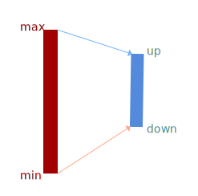
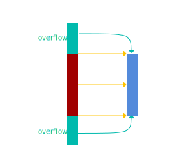

# 这是大一c语言附加题

## Q1:

单词纠错是蛮简单的，但是容易有较大计算，减少不必要的运算（win `gcc 13.2.0` 下0.2360 s，wsl `gcc 12.2.0` 下0.2226 s ）

## Q2:

图像卷积非常简单，主要是注意溢出，同时还有不同操作系统下，类型大小不一样导致的问题。

在部分卷积核中，运算后结果可能是负的，导致溢出（是的，所给的 `pdf` 里面示例是奇异的），为解决此问题，我曾经采用了区间标准化方法：

$$
newX=\frac{X-min}{max-min}\cdot(up-down)+down
$$

虽然结果有点怪怪的，但是总比溢出好。或者使用：

$$
if \space X>255 \to X=255 
$$

$$
if \space X<0 \to X=0 
$$

如果把代码拿到linux下会发现报错，原因在于`cv.h`里面用的是`long`，而linux和Windows下`long`长度不一样（见表），我将它们改成了`int`，效果良好。

<table style="text-align: center;
        margin:0px auto;">
    <tr>
        <th colspan="2" >windows vc12</th> 
        <th colspan="2" >linux gcc-5.3.1</th> 
        <th>Compiler</th> 
    </tr>
    <tr>
  		 <td>win32</td> 
      	 <td>win64</td>
         <td>i686</td>
         <td>x86_64</td>
         <td>Target</td> 
    </tr>
    <tr>
        <td colspan="2">1</td> 
        <td>1</td> 
        <td>1</td> 
        <td>(unsigned) char</td> 
    </tr>
    <tr>
        <td colspan="2">2</td>
        <td>2</td> 
        <td>2</td> 
        <td>(unsigned) short</td> 
    </tr>
    <tr>
        <td colspan="2">4</td>
        <td>4</td> 
        <td>4</td> 
        <td>(unsigned) int</td> 
    </tr>
    <tr>
        <td colspan="2">4</td>
        <td>4</td> 
        <td>8</td> 
        <td>(unsigned) long</td> 
    </tr>
    <!--
    <tr>
        <td colspan="2">4</td>
        <td>4</td> 
        <td>4</td> 
        <td>float</td> 
    </tr>
    <tr>
        <td colspan="2">8</td>
        <td>8</td> 
        <td>8</td> 
        <td>double</td> 
    </tr>
    -->
    <tr>
        <td colspan="2">4</td>
        <td>4</td> 
        <td>8</td> 
        <td>long int</td> 
    </tr>
    <!--
    <tr>
        <td colspan="2">8</td>
        <td>8</td> 
        <td>8</td> 
        <td>long long</td> 
    </tr>
    -->
    <tr>
        <td colspan="2">8</td>
        <td>12</td> 
        <td>16</td> 
        <td>long double</td> 
    </tr>
    
</table>

